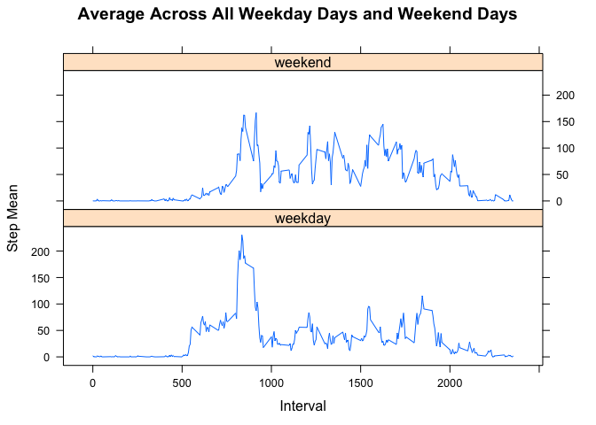

# Reproducible Research: Peer Assessment 1


## Loading and preprocessing the data


```r
data <- read.csv("activity.csv");
```


## What is mean total number of steps taken per day?


```r
df_sum_by_date = ddply(data, .(date), summarise, step_sum=sum(steps, na.rm = TRUE))

hist(df_sum_by_date$step_sum, breaks=20, xlab="Steps", main="Distribution of Step Day Totals")
```

 


```r
mean_steps_day <- format(round(mean(df_sum_by_date$step_sum), digits = 2), nsmall = 2)
```
Mean number of steps taken per day: **9354.23**


```r
median_steps_day <- format(round(median(df_sum_by_date$step_sum), digits = 2), nsmall = 2)
```
Medium number of steps taken per day: **10395.00**


## What is the average daily activity pattern?


```r
df_mean_by_interval = ddply(data, .(interval), summarise, step_mean=mean(steps, na.rm = TRUE))

plot(df_mean_by_interval$interval, df_mean_by_interval$step_mean, type = "l", xlab="Interval", ylab="Average Steps", main="Average Number of Steps Taken Across All Days")
```

 

```r
max_step_mean <- max(df_mean_by_interval$step_mean)
l_max <- df_mean_by_interval$step_mean == max_step_mean
max_interval <- df_mean_by_interval[l_max,"interval"]
```

Interval with maximum number of steps: **835**


## Imputing missing values


```r
l_missing_value = is.na(data$step)
missing_value_total <- sum(l_missing_value)
```

Total number of missing values in the dataset: **2304**

Creating a new dataset that is equal to the original dataset but with the missing data filled in. A missing value will be set to the mean of its 5-minute interval.


```r
data_complete <- data.frame(steps = integer(), date = factor(), interval = integer())
data_complete <- rbind(data_complete, data)

for (i in 1:nrow(data_complete)) {
  row <- data_complete[i,]
  if(is.na(row$steps)){
    l_interval <- df_mean_by_interval$interval == row$interval
    data_complete[i,"steps"] <- df_mean_by_interval[l_interval, ]$step_mean
  }
}
```


```r
df_complete_sum_by_date = ddply(data_complete, .(date), summarise, step_sum=sum(steps, na.rm = TRUE))

hist(df_complete_sum_by_date$step_sum, breaks=20, xlab="Steps", main="Distribution of Step Day Totals - No Missing Data")
```

 


```r
mean_complete_steps_day <- format(round(mean(df_complete_sum_by_date$step_sum), digits=2), nsmall = 2)
```
Mean number of steps taken per day: **10766.19**


```r
median_complete_steps_day <- format(round(median(df_complete_sum_by_date$step_sum), digits = 2), nsmall = 2)
```
Median number of steps taken per day: **10766.19**

Filling in the missing data increased the total steps per day and made the total's average equal to the total's median.


## Are there differences in activity patterns between weekdays and weekends?

Created a new factor variable, day_type, in the dataset with two levels – “weekday” and “weekend” indicating whether a given date is a weekday or weekend day.


```r
data_complete$day <- weekdays(as.Date(data_complete$date))

l_weekday <- weekdays(as.Date(data_complete$date)) %in% c("Monday", "Tuesday", "Wednesday", "Thursday", "Friday")
data_complete[l_weekday,"day_type"] <- "weekday"

l_weekend <- weekdays(as.Date(data_complete$date)) %in% c("Saturday", "Sunday")
data_complete[l_weekend,"day_type"] <- "weekend"

data_complete$day_type <- factor(data_complete$day_type, levels = c("weekday", "weekend"))
```


Made a panel plot containing a time series plot of the 5-minute interval (x-axis) and the average number of steps taken, averaged across all weekday days or weekend days (y-axis).


```r
df_mean_by_interval_day_type = ddply(data_complete, .(interval,day_type), summarise, step_mean=mean(steps, na.rm = TRUE))

xyplot(step_mean ~ interval | day_type, data=df_mean_by_interval_day_type, type = "l", xlab = "Interval", ylab = "Step Mean", main="Average Across All Weekday Days and Weekend Days", layout = c(1, 2))
```

 
